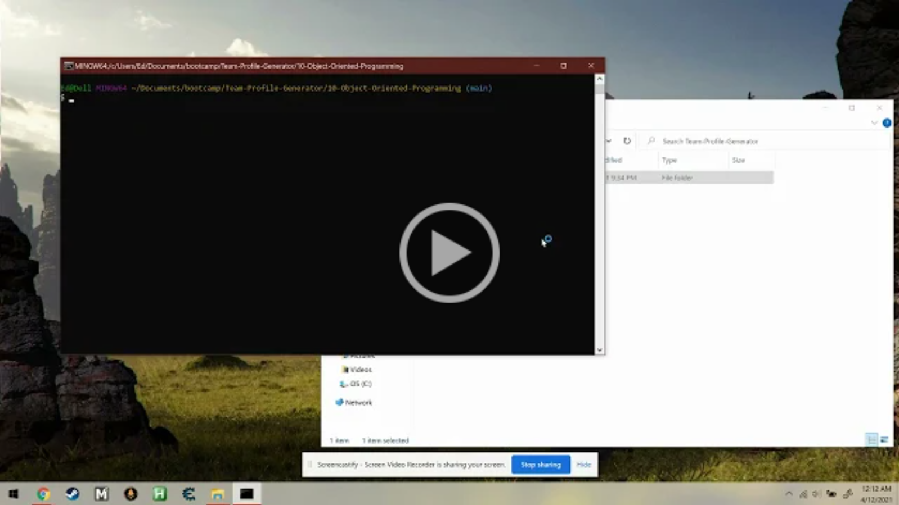

# 10 Object-Oriented Programming
# Team Profile Generator

This application is a Team Profile Generator run through the command line. Users are taken through a series of prompts to populate an HTML file with their team's information. The generated HTML file is then saved to the dist/ folder in the application's repository on their local machine.

The Team Profile Generator's GitHub repository can be found [here](https://github.com/elisesamanthadaly/10-Object-Oriented-Programming).

## Installation

Clone the repository to your local machine. You should also have Git Bash and Node.js installed. You'll need to run npm install from the terminal at the root directory of the local repository to install the application's dependencies (fs, inquirer, and jest).

## Usage

This video details how to use the Team Profile Generator:

## Tests

There are four tests (one each for the parent Employee class and its three subclasses: Manager, Engineer, and Intern) that be can be run through the command line to verify that the properties and methods of each of the classes are intact and functioning:
* npm test Employee
* npm test Manager
* npm test Engineer
* npm test Intern

## Technologies Used

* HTML, CSS, Javascript
* Node.js

## Credits

This application relies on [Inquirer.js](https://www.npmjs.com/package/inquirer). [Jest](https://www.npmjs.com/package/jest) is required for the tests.

## License

MIT License

Copyright (c) 2021 Elise Daly

Permission is hereby granted, free of charge, to any person obtaining a copy
of this software and associated documentation files (the "Software"), to deal
in the Software without restriction, including without limitation the rights
to use, copy, modify, merge, publish, distribute, sublicense, and/or sell
copies of the Software, and to permit persons to whom the Software is
furnished to do so, subject to the following conditions:

The above copyright notice and this permission notice shall be included in all
copies or substantial portions of the Software.

THE SOFTWARE IS PROVIDED "AS IS", WITHOUT WARRANTY OF ANY KIND, EXPRESS OR
IMPLIED, INCLUDING BUT NOT LIMITED TO THE WARRANTIES OF MERCHANTABILITY,
FITNESS FOR A PARTICULAR PURPOSE AND NONINFRINGEMENT. IN NO EVENT SHALL THE
AUTHORS OR COPYRIGHT HOLDERS BE LIABLE FOR ANY CLAIM, DAMAGES OR OTHER
LIABILITY, WHETHER IN AN ACTION OF CONTRACT, TORT OR OTHERWISE, ARISING FROM,
OUT OF OR IN CONNECTION WITH THE SOFTWARE OR THE USE OR OTHER DEALINGS IN THE
SOFTWARE.
